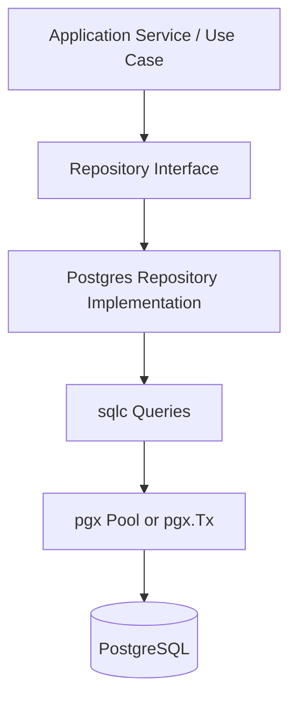
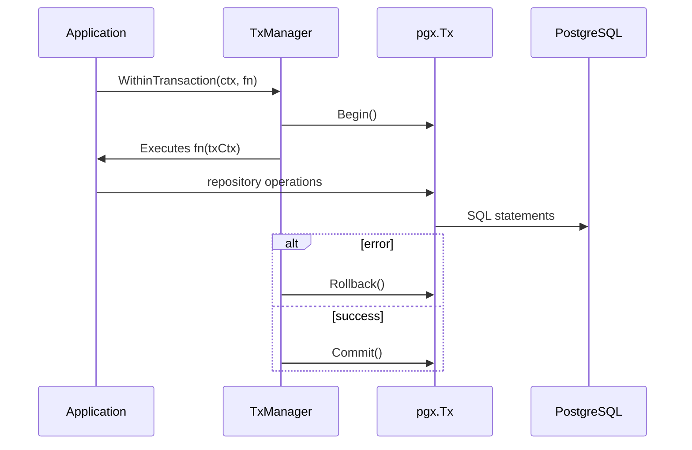

# Persistence Implementation Guide

## Overview

This document describes the architecture and operation of the system's persistence layer.

The goals of this architecture are:

* To keep the domain completely isolated from the infrastructure.
* To support atomic transactions when necessary.
* To allow simple operations without transactional overhead.
* To integrate `pgx` and `sqlc` without leaking their types into the domain.
* To guarantee high performance and type safety.
* To maintain system testability.
* To establish clear rules for the use of repositories and transactions.

This document is independent of any specific use case. The included examples are for illustrative purposes only.

---

# 1. General Architecture

The persistence layer follows Clean Architecture principles:

```
Application / Use Cases
        ↓
Domain Repository Interfaces
        ↓
Infrastructure Repository Implementations
        ↓
sqlc Queries
        ↓
pgx (Pool / Tx)
        ↓
PostgreSQL

```

## General Diagram



The application layer depends solely on interfaces.
The infrastructure depends on external libraries.

---

# 2. Separation of Responsibilities

## 2.1 Domain Layer

Location:

```
internal/domain/repositories/

```

Only interfaces are defined here.

Example:

```go
type AccountRepository interface {
    Create(ctx context.Context, account *models.Account) error
    GetByID(ctx context.Context, id uuid.UUID) (*models.Account, error)
}

```

Fundamental Rules:

* The domain does not import `pgx`.
* The domain does not import `sqlc`.
* The domain does not know PostgreSQL details.
* The domain defines contracts, not implementations.

---

## 2.2 Infrastructure Layer

Suggested Location:

```
internal/infrastructure/database/postgres/

```

Example:

```go
type accountRepository struct {
    pool *pgxpool.Pool
}

```

The repository:

* Does not execute manual SQL.
* Does not use `pool.Exec` directly.
* Does not open or close transactions.
* Always utilizes `sqlc.Queries`.

---

# 3. sqlc Integration

`sqlc` generates a structure:

```go
type Queries struct {
    db DBTX
}

```

Where `DBTX` can be:

* `*pgxpool.Pool`
* `pgx.Tx`

This abstraction allows the same queries to function in both transactional and non-transactional modes.

---

## 3.1 Repository Constructor

```go
type accountRepository struct {
    pool *pgxpool.Pool
}

func NewAccountRepository(pool *pgxpool.Pool) domain.AccountRepository {
    return &accountRepository{
        pool: pool,
    }
}

```

The repository receives the pool but does not use it directly to execute queries.

---

## 3.2 Dynamic Query Resolution

Key Design:

```go
type txKey struct{}

func getQueries(ctx context.Context, pool *pgxpool.Pool) *sqlc.Queries {
    if q, ok := ctx.Value(txKey{}).(*sqlc.Queries); ok {
        return q
    }
    return sqlc.New(pool)
}

```

Behavior:

* If the context contains an instance of `*sqlc.Queries` associated with a transaction, that one is used.
* If not, an instance associated with the pool is created.

The domain never knows if it is inside or outside of a transaction.

---

## 3.3 Repository Implementation

```go
func (r *accountRepository) Create(
    ctx context.Context,
    account *models.Account,
) error {

    q := getQueries(ctx, r.pool)

    err := q.CreateAccount(ctx, sqlc.CreateAccountParams{
        ID:     account.ID,
        Email:  account.Email,
        Status: string(account.Status),
    })

    if err != nil {
        return mapPostgresError(err)
    }

    return nil
}

```

The repository:

* Does not commit.
* Does not rollback.
* Does not open transactions.
* Only executes queries.

---

# 4. Non-Transactional Operations

Not all operations require an explicit transaction.

Typical Cases:

* Simple queries (SELECT).
* Individual atomic updates.
* Supporting reads.
* Pre-validations.

Example:

```go
func (r *accountRepository) GetByID(
    ctx context.Context,
    id uuid.UUID,
) (*models.Account, error) {

    q := getQueries(ctx, r.pool)

    row, err := q.GetAccountByID(ctx, id)
    if err != nil {
        return nil, mapPostgresError(err)
    }

    return mapToDomainAccount(row), nil
}

```

Flow in this scenario:

```
Application → Repository → sqlc → pgxpool.Pool → PostgreSQL

```

The following do not exist:

* Begin
* Commit
* Rollback

PostgreSQL guarantees atomicity at the statement level. This is the default system behavior.

---

# 5. Transactional Operations

Transactions are used when multiple operations must be atomic.

Generic Examples:

* Creation of multiple related aggregates.
* Coordinated updates between tables.
* Operations that must maintain invariants between entities.

---

# 6. Transaction Manager

An abstraction is defined to decouple the application from `pgx`.

Suggested Location:

```
internal/domain/ports/

```

Interface:

```go
type TxManager interface {
    WithinTransaction(
        ctx context.Context,
        fn func(ctx context.Context) error,
    ) error
}

```

The application layer depends solely on this interface.

---

# 7. Implementation with pgx

```go
type PostgresTxManager struct {
    pool *pgxpool.Pool
}

func NewPostgresTxManager(pool *pgxpool.Pool) *PostgresTxManager {
    return &PostgresTxManager{pool: pool}
}

```

---

## 7.1 Complete Implementation

```go
func (m *PostgresTxManager) WithinTransaction(
    ctx context.Context,
    fn func(ctx context.Context) error,
) error {

    tx, err := m.pool.Begin(ctx)
    if err != nil {
        return err
    }

    q := sqlc.New(tx)
    txCtx := context.WithValue(ctx, txKey{}, q)

    if err := fn(txCtx); err != nil {
        _ = tx.Rollback(ctx)
        return err
    }

    if err := tx.Commit(ctx); err != nil {
        return err
    }

    return nil
}

```

Transaction Manager Responsibilities:

* Open the transaction.
* Inject `sqlc.Queries` (linked to `pgx.Tx`) into the context.
* Execute the closure.
* Commit if there is no error.
* Rollback if an error occurs.

---

## 7.2 Sequence Diagram



---

# 8. Illustrative Example

The following example is purely demonstrative and does not represent a specific system use case.

## 8.1 Example With Transaction

```go
func (s *ApplicationService) ExecuteOperation(
    ctx context.Context,
) error {

    return s.txManager.WithinTransaction(ctx, func(txCtx context.Context) error {

        if err := s.repoA.Create(txCtx, entityA); err != nil {
            return err
        }

        if err := s.repoB.Update(txCtx, entityB); err != nil {
            return err
        }

        return nil
    })
}

```

If any operation fails:

* A rollback is executed.
* No changes are persisted.

---

## 8.2 Example Without Transaction

```go
func (s *ApplicationService) QueryEntity(
    ctx context.Context,
    id uuid.UUID,
) (*models.Entity, error) {

    return s.repoA.GetByID(ctx, id)
}

```

In this scenario:

* `WithinTransaction` is not used.
* The repository operates with the pool.
* The operation is atomic at the SQL statement level.

---

# 9. Architectural Rules

1. Repositories never commit or rollback.
2. Only the Transaction Manager controls the transaction.
3. The domain never imports `pgx` or `sqlc`.
4. Error mapping is performed in the infrastructure layer.
5. Transactions are defined in the application layer.
6. Not all operations must use a transaction.
7. Simple queries should be executed without transactional overhead.

---

# 10. Error Handling

Example:

```go
func mapPostgresError(err error) error {

    var pgErr *pgconn.PgError

    if errors.As(err, &pgErr) {

        if pgErr.Code == "23505" {
            return domain.ErrConflict
        }
    }

    return err
}

```

Rules:

* Never expose technical PostgreSQL errors to the domain.
* Translate infrastructure errors into business errors.
* Centralize mapping within the infrastructure layer.

---

# 11. Concurrency and Integrity

Integrity is primarily guaranteed through:

* Unique constraints.
* Foreign keys.
* Default isolation level (Read Committed).

The database protects against race conditions. The application translates constraint violations into domain errors.

---

# 12. Design Benefits

* Strict separation between domain and infrastructure.
* Explicit and controlled transactions.
* High performance thanks to pgx.
* Type safety via sqlc.
* Repositories are easily mockable.
* Absence of external dependency leakage.
* Simplicity for non-transactional operations.
* Future scalability.

---

# 13. Conclusion

The persistence layer is designed to be:

* Explicit.
* Predictable.
* Performant.
* Architecturally sound.

It allows the execution of both simple operations and complex transactional ones, while always maintaining the separation of responsibilities and isolating the domain from the infrastructure.
