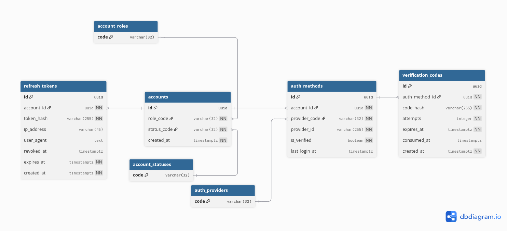

# 📖 Data Dictionary: Auth Service Database

This document serves as the formal data dictionary for the Authentication Service. It details the structure, relationships, and constraints of each entity to ensure data integrity and system scalability.

## 📐 Entity Relationship Diagram (ERD)

The following diagram illustrates the relationships between accounts, authentication methods, sessions, and master catalogs.



---

## 🗂️ Tables Definition

### 1. TABLE: `account_roles`

**Description:** A master catalog defining the available permission levels within the system.

| Column | Type | Constraints | Description |
| --- | --- | --- | --- |
| `code` | `VARCHAR(32)` | `PRIMARY KEY` | Unique identifier (e.g., 'ADMIN', 'USER', 'MODERATOR'). |
| `description` | `TEXT` | `NULL` | Human-readable explanation of the role's scope and permissions. |

---

### 2. TABLE: `account_statuses`

**Description:** A master catalog for the lifecycle states of a user account.

| Column | Type | Constraints | Description |
| --- | --- | --- | --- |
| `code` | `VARCHAR(32)` | `PRIMARY KEY` | Unique state identifier (e.g., 'PENDING', 'ACTIVE', 'BANNED', 'DELETED'). |

---

### 3. TABLE: `auth_providers`

**Description:** A catalog of supported identity providers for the authentication process.

| Column | Type | Constraints | Description |
| --- | --- | --- | --- |
| `code` | `VARCHAR(32)` | `PRIMARY KEY` | Unique provider name (e.g., 'GOOGLE', 'EMAIL', 'APPLE'). |

---

### 4. TABLE: `accounts`

**Description:** The primary entity representing a user. It acts as the central hub connecting roles and statuses. It contains no sensitive login data.

| Column | Type | Constraints | Description |
| --- | --- | --- | --- |
| `id` | `UUID` | `PK`, `DEFAULT gen_v4` | Unique internal identifier for the account. |
| `role_code` | `VARCHAR(32)` | `FK -> account_roles` | Current role assigned to the user. |
| `status_code` | `VARCHAR(32)` | `FK -> account_statuses` | Current operational state of the account. |
| `created_at` | `TIMESTAMPTZ` | `NOT NULL`, `DEFAULT now()` | Timestamp when the account record was created. |

---

### 5. TABLE: `auth_methods`

**Description:** Stores various ways a user can prove their identity. One account can have multiple methods linked.

| Column | Type | Constraints | Description |
| --- | --- | --- | --- |
| `id` | `UUID` | `PK`, `DEFAULT gen_v4` | Unique identifier for the auth method. |
| `account_id` | `UUID` | `FK -> accounts`, `CASCADE` | Link to the owner account. |
| `provider_code` | `VARCHAR(32)` | `FK -> auth_providers` | Type of provider used (e.g., 'EMAIL'). |
| `provider_id` | `VARCHAR(255)` | `UNIQUE (with provider)` | External ID (Email address or Google Subject ID). |
| `is_verified` | `BOOLEAN` | `DEFAULT FALSE` | Flag indicating if the identity was confirmed by the user. |
| `last_login_at` | `TIMESTAMPTZ` | `NULL` | Timestamp of the last successful login using this method. |

---

### 6. TABLE: `verification_codes`

**Description:** Manages short-lived security codes for OTP (One-Time Password) or email verification flows.

| Column | Type | Constraints | Description |
| --- | --- | --- | --- |
| `id` | `UUID` | `PK` | Unique identifier for the verification attempt. |
| `auth_method_id` | `UUID` | `FK -> auth_methods` | The specific authentication method being verified. |
| `code_hash` | `VARCHAR(255)` | `NOT NULL` | Secure hash of the 6-digit or alpha code. |
| `attempts` | `INTEGER` | `DEFAULT 0` | Counter for failed attempts to mitigate brute-force. |
| `expires_at` | `TIMESTAMPTZ` | `NOT NULL` | Expiration deadline for the code. |
| `consumed_at` | `TIMESTAMPTZ` | `NULL` | Timestamp when the code was successfully used. |
| `created_at` | `TIMESTAMPTZ` | `DEFAULT now()` | Timestamp when the code was issued. |

---

### 7. TABLE: `refresh_tokens`

**Description:** Tracks active long-lived sessions, enabling "Keep me logged in" features and session auditing for security.

| Column | Type | Constraints | Description |
| --- | --- | --- | --- |
| `id` | `UUID` | `PK` | Unique session identifier. |
| `account_id` | `UUID` | `FK -> accounts` | The account owner of the session. |
| `token_hash` | `VARCHAR(255)` | `UNIQUE`, `NOT NULL` | Secure hash of the refresh token. |
| `ip_address` | `VARCHAR(45)` | `NULL` | Client's IP address (supports IPv4 and IPv6). |
| `user_agent` | `TEXT` | `NULL` | Browser or mobile device information string. |
| `revoked_at` | `TIMESTAMPTZ` | `NULL` | If not null, the session is manually terminated. |
| `expires_at` | `TIMESTAMPTZ` | `NOT NULL` | Token expiration date. |
| `created_at` | `TIMESTAMPTZ` | `DEFAULT now()` | Timestamp when the session started. |

---

## 🛠️ Design Maintenance (DBML)

To visualize or edit this schema, paste the following code into [dbdiagram.io](https://dbdiagram.io):

```dbml
// 1. MASTER TABLES
Table account_roles {
  code varchar(32) [pk]
  description text
}

Table account_statuses {
  code varchar(32) [pk]
}

Table auth_providers {
  code varchar(32) [pk]
}

// 2. DYNAMIC TABLES
Table accounts {
  id uuid [pk, default: `uuid_generate_v4()`]
  role_code varchar(32) [not null, ref: > account_roles.code]
  status_code varchar(32) [not null, ref: > account_statuses.code]
  created_at timestamptz [not null, default: `now()`]
}

Table auth_methods {
  id uuid [pk, default: `uuid_generate_v4()`]
  account_id uuid [not null, ref: > accounts.id]
  provider_code varchar(32) [not null, ref: > auth_providers.code]
  provider_id varchar(255) [not null]
  is_verified boolean [not null, default: false]
  last_login_at timestamptz

  Indexes {
    (provider_code, provider_id) [unique]
  }
}

Table verification_codes {
  id uuid [pk, default: `uuid_generate_v4()`]
  auth_method_id uuid [not null, ref: > auth_methods.id]
  code_hash varchar(255) [not null]
  attempts integer [not null, default: 0]
  expires_at timestamptz [not null]
  consumed_at timestamptz
  created_at timestamptz [not null, default: `now()`]
}

Table refresh_tokens {
  id uuid [pk, default: `uuid_generate_v4()`]
  account_id uuid [not null, ref: > accounts.id]
  token_hash varchar(255) [unique, not null]
  ip_address varchar(45)
  user_agent text
  revoked_at timestamptz
  expires_at timestamptz [not null]
  created_at timestamptz [not null, default: `now()`]
}

```

---

**Last Updated:** February 13, 2026