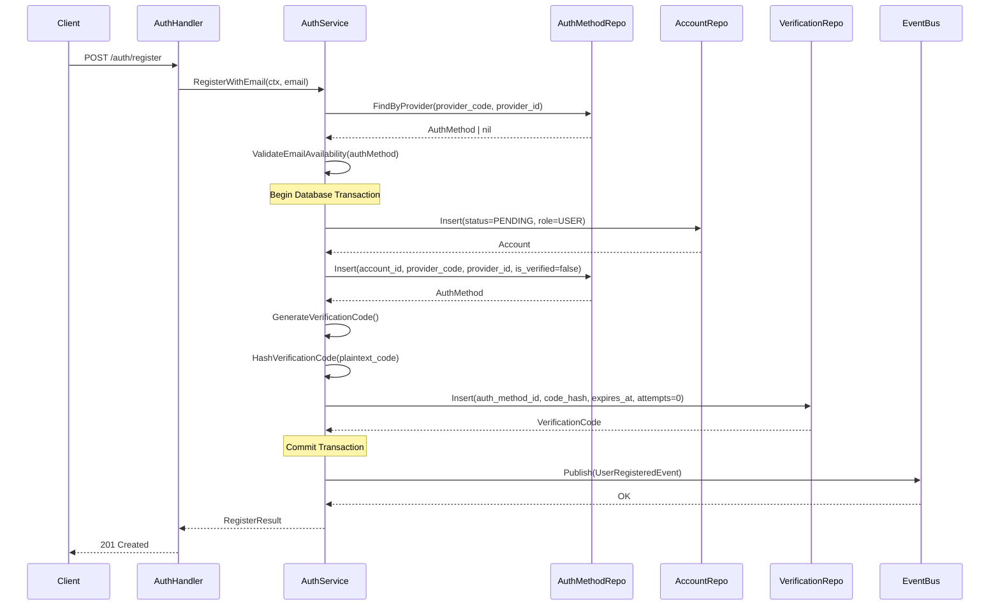

# Use Case: User Registration via Email

---

# Actors

* **Client**: Mobile or Web application
* **AuthHandler (API Layer)**: Handles HTTP transport and request/response parsing
* **AuthService (Application Layer)**: Orchestrates business logic and domain rules
* **AccountRepository**: Handles persistence for the `accounts` table
* **AuthMethodRepository**: Handles persistence for authentication methods
* **VerificationCodeRepository**: Handles persistence for OTP / verification codes
* **EventBus (Pub/Sub)**: Manages asynchronous event publishing

---

# Data Models

## accounts

* `id` (UUID)
* `status_code` (`PENDING`, `ACTIVE`)
* `role_code` (String)
* `created_at` (Timestamp)

---

## auth_methods

* `id` (UUID)
* `account_id` (UUID)
* `provider_code` (e.g. `EMAIL`)
* `provider_id` (String — email)
* `is_verified` (Boolean)
* `last_login_at` (Timestamp, nullable)

---

## verification_codes

* `id` (UUID)
* `auth_method_id` (UUID)
* `code_hash` (String)
* `attempts` (Integer — initialized to 0)
* `expires_at` (Timestamp)
* `consumed_at` (Timestamp, nullable)
* `created_at` (Timestamp)

---

# Sequence Diagram



---

# Success Response

When the registration process completes successfully:

| Field                   | Type    | Description                                  |
| ----------------------- | ------- | -------------------------------------------- |
| `message`               | String  | Registration state indicator                 |
| `verification_required` | Boolean | Indicates that email verification is pending |

---

### Response Body (201 Created)

```json
{
  "message": "registration_pending",
  "verification_required": true
}
```

---

# Error Handling

| Error Code               | Trigger Condition                    | State Consequence | HTTP Status | Response                                |
| ------------------------ | ------------------------------------ | ----------------- | ----------- | --------------------------------------- |
| `account_already_exists` | Auth method found for provided email | No state mutation | 409         | `{ "error": "account_already_exists" }` |
| `internal_error`         | Any failure inside transaction       | Full rollback     | 500         | `{ "error": "internal_error" }`         |

---

# Operational Rules

* All database mutations must occur inside a single transaction
* Verification code must be securely generated and hashed before persistence
* `attempts` must be initialized to `0`
* Event publication must occur only after successful transaction commit
* Repositories must not contain business logic
* No partial state must be persisted if any step fails
* Public error messages must not expose internal validation details