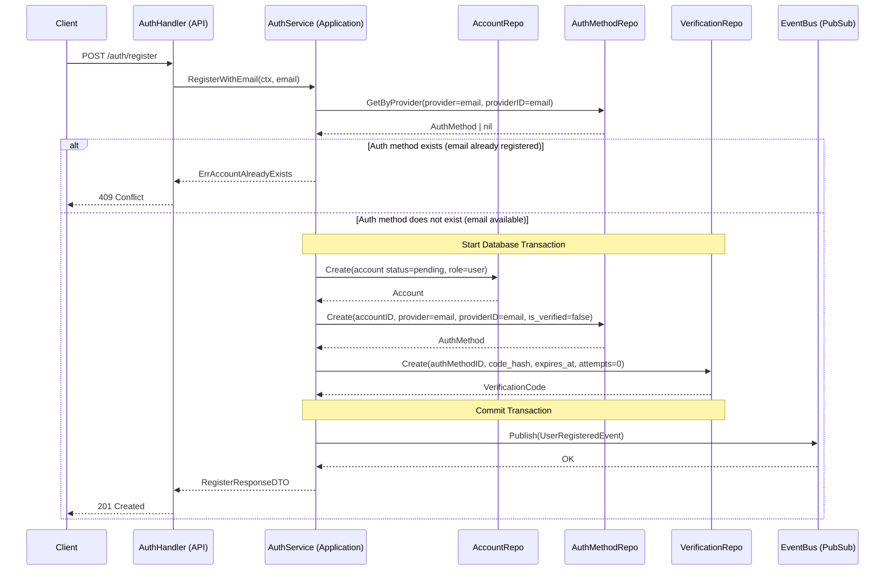

# Use Case: User Registration via Email

## Actors

1. **Client**: Mobile or Web application.
2. **AuthHandler (API Layer)**: Handles HTTP transport and request/response parsing.
3. **AuthService (Application Layer)**: Orchestrates business logic and domain rules.
4. **AccountRepository**: Handles persistence for the accounts table.
5. **AuthMethodRepository**: Handles persistence for authentication methods.
6. **VerificationCodeRepository**: Handles persistence for OTP / verification codes.
7. **EventBus (Pub/Sub)**: Manages asynchronous event publishing.

---

## Data Models

### accounts

* `id` (UUID)
* `status` (`pending`, `active`)
* `role_code` (String — role identifier, e.g. `user`, `admin`)
* `created_at` (Timestamp)

### auth_methods

* `id` (UUID)
* `account_id` (UUID)
* `provider_code` (e.g. `email`)
* `provider_id` (String — provider identifier, e.g. the email address)
* `is_verified` (Boolean)
* `last_login_at` (Timestamp, nullable)

### verification_codes

* `id` (UUID)
* `auth_method_id` (UUID)
* `code_hash` (String)
* `attempts` (Integer)
* `expires_at` (Timestamp)
* `consumed_at` (Timestamp, nullable)
* `created_at` (Timestamp)

---

## Request DTO

```json
{
  "email": "user@email.com"
}
```

---

## Response DTO (Success)

```json
{
  "message": "registration_pending",
  "verification_required": true
}
```

### HTTP Status

```
201 Created
```

---

## Error Response — Email Already Registered

```json
{
  "error": "account_already_exists"
}
```

### HTTP Status

```
409 Conflict
```

---

## Sequence Diagram



---

## Detailed Flow

---

### 1. Client → API

**Endpoint**

```
POST /auth/register
```

**Payload**

```json
{
  "email": "user@email.com"
}
```

---

### 2. API Layer

**Method**

```go
func (h *AuthHandler) RegisterWithEmail(w http.ResponseWriter, r *http.Request)
```

**Responsibilities**

* Parse incoming request
* Validate email format
* Invoke application service
* Map domain errors to HTTP responses

---

### 3. Application Layer

**Method**

```go
func (s *AuthService) RegisterWithEmail(ctx context.Context, email string) (*RegisterResponseDTO, error)
```

---

### Step 1 — Verify Email Availability

```go
authMethod, err := authMethodRepo.GetByProvider(ctx, "email", email)

if authMethod != nil {
    return nil, ErrAccountAlreadyExists
}
```

Business rule:

* The existence of an auth method with that email is sufficient to reject the registration.
* No idempotent behavior.
* If the client wants a new code, that is a different use case.

---

### Step 2 — Create Account

* `status = pending`
* `role_code = user` (default)

```go
accountRepo.Create(ctx, account)
```

---

### Step 3 — Create Auth Method

* `provider_code = "email"`
* `provider_id = email`
* `is_verified = false`

```go
authMethodRepo.Create(ctx, account.ID, "email", email)
```

---

### Step 4 — Create Verification Code

* Generate plaintext OTP
* Hash securely
* Set expiration timestamp
* Initialize `attempts = 0`

```go
verificationRepo.Create(ctx, authMethodID, codeHash, expiresAt)
```

---

### Step 5 — Commit Transaction

The following operations must occur within a single database transaction:

1. Create Account
2. Create Auth Method
3. Create Verification Code

If any step fails → rollback.

---

### Step 6 — Publish Event

After a successful commit:

```go
eventBus.Publish(UserRegisteredEvent{
    AccountID: account.ID,
    Email: email,
    PlaintextCode: code,
})
```

This event is consumed by another microservice responsible for sending the verification email.

---

## Final State

* Account persisted with `status = pending`
* Auth method created with `is_verified = false`
* Verification code stored hashed and active
* Event published to Pub/Sub
* HTTP 201 returned to client

---

## Transactional Considerations

* Database operations must be atomic.
* Event publication must occur only after successful commit.
* No verification code is reissued in this use case.
* If email already exists → return `409 Conflict`.
