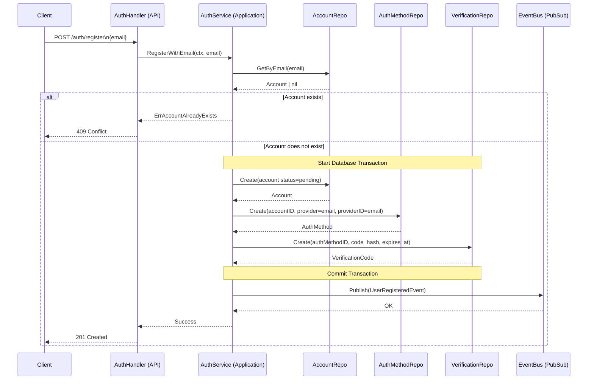

# Use Case: User Registration via Email

## Actors

1. **Client**: Mobile or Web application.
2. **AuthHandler (API Layer)**: Handles HTTP transport and request/response parsing.
3. **AuthService (Application Layer)**: Orchestrates business logic and domain rules.
4. **AccountRepository**: Handles persistence for the accounts table.
5. **AuthMethodRepository**: Handles persistence for authentication methods.
6. **VerificationCodeRepository**: Handles persistence for OTP/Verification codes.
7. **EventBus (Pub/Sub)**: Manages asynchronous event publishing.

---

## Data Models

### accounts

* `id` (UUID)
* `status` (`pending`, `active`)
* `role_code` (String — role identifier, e.g. `user`, `admin`)
* `created_at` (Timestamp)

### auth_methods

* `id` (UUID)
* `account_id` (UUID)
* `provider_code` (e.g. `email`)
* `provider_id` (String — provider identifier, e.g. the email address)
* `is_verified` (Boolean)
* `last_login_at` (Timestamp, nullable)

### verification_codes

* `id` (UUID)
* `auth_method_id` (UUID)
* `code_hash` (String)
* `attempts` (Integer)
* `expires_at` (Timestamp)
* `consumed_at` (Timestamp, nullable)
* `created_at` (Timestamp)

---

## Sequence Diagram



---

## Detailed Flow

### 1. Client → API

**Endpoint:** `POST /auth/register`
**Payload:**

```json
{
  "email": "user@email.com"
}

```

---

### 2. API Layer

**Method**

```go
func (h *AuthHandler) RegisterWithEmail(w http.ResponseWriter, r *http.Request)

```

**Responsibilities**

* Parse the incoming request.
* Validate the email format.
* Invoke the Application Layer service.

---

### 3. Application Layer

**Method**

```go
func (s *AuthService) RegisterWithEmail(ctx context.Context, email string) error

```

#### Step 1 — Verify Existence

* Invoke `accountRepo.GetByEmail(ctx, email)`.
* If account exists: Return error.
* If account does not exist: Proceed.

#### Step 2 — Create Account

* Set `status = pending`.
* Invoke `accountRepo.Create(ctx, account)`.

#### Step 3 — Create Auth Method

* Link the account ID with the "email" type.
* Link the account ID with the "email" provider code and the email address as `provider_id`.
* Invoke `authMethodRepo.Create(ctx, account.ID, "email", email)`.

#### Step 4 — Create Verification Code

* Generate a plaintext OTP code.
* Generate a secure Hash of the code.
* Define expiration timestamp.
* Invoke `verificationRepo.Create(ctx, authMethodID, codeHash, expiresAt)` (the code is linked to the auth method created in the previous step).

#### Step 5 — Publish Event

* Emit `UserRegisteredEvent` to trigger the notification workflow.
* The event payload includes `AccountID`, `Email`, and `PlaintextCode`.

---

## Final State

* **Account** persisted in `pending` status.
* **Auth Method** linked to the account.
* **Verification Code** generated and hashed in database.
* **Event** published to the Event Bus.

---

## Transactional Considerations

The creation of the **Account**, **Auth Method**, and **Verification Code** must be executed within a single database transaction to ensure atomicity. The event publication must occur only after a successful commit.
