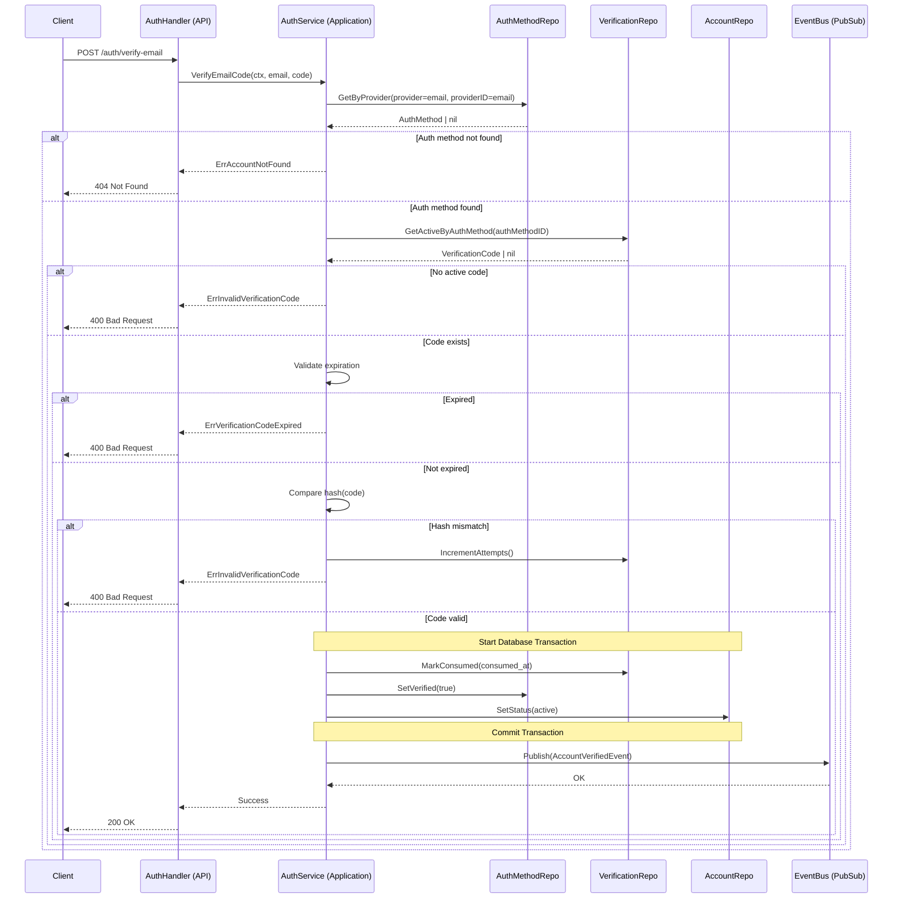
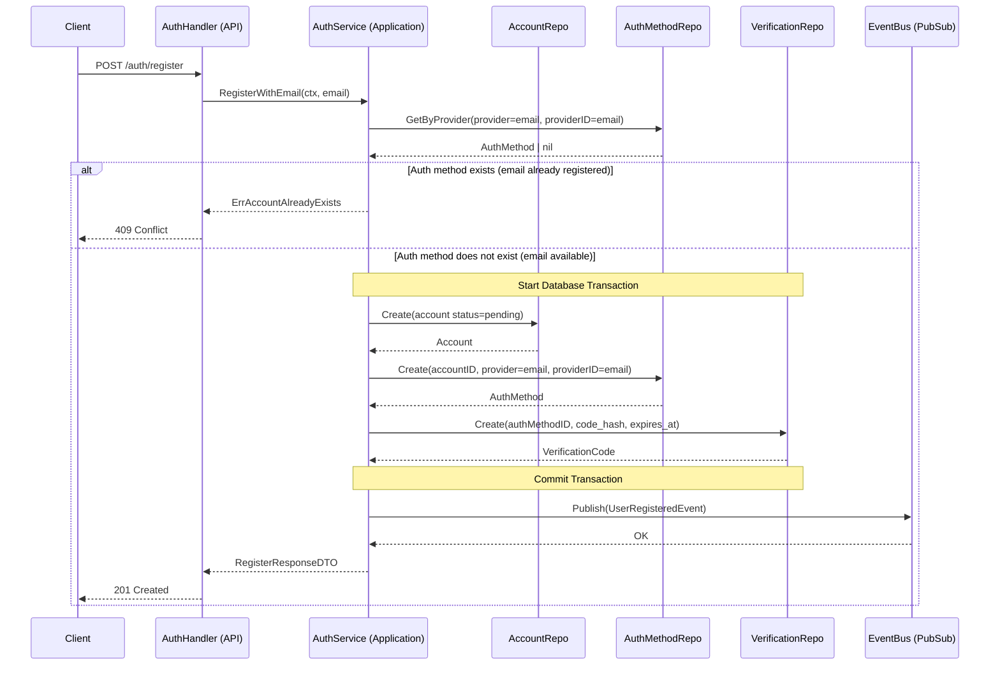

# Use Case: User Registration via Email

## Actors

1. **Client**: Mobile or Web application.
2. **AuthHandler (API Layer)**: Handles HTTP transport and request/response parsing.
3. **AuthService (Application Layer)**: Orchestrates business logic and domain rules.
4. **AccountRepository**: Handles persistence for the accounts table.
5. **AuthMethodRepository**: Handles persistence for authentication methods.
6. **VerificationCodeRepository**: Handles persistence for OTP / verification codes.
7. **EventBus (Pub/Sub)**: Manages asynchronous event publishing.
Perfecto. Manteniendo exactamente el mismo nivel, estructura y formalidad, aquí está el **Use Case: Verify Email Code** completo y consistente con tu arquitectura.

---

# Use Case: Verify Email Code

## Actors

1. **Client**: Mobile or Web application.
2. **AuthHandler (API Layer)**: Handles HTTP transport and request/response parsing.
3. **AuthService (Application Layer)**: Orchestrates business logic and domain rules.
4. **AccountRepository**: Handles persistence for the accounts table.
5. **AuthMethodRepository**: Handles persistence for authentication methods.
6. **VerificationCodeRepository**: Handles persistence for OTP / verification codes.
7. **EventBus (Pub/Sub)**: Manages asynchronous event publishing.

---

## Data Models

### accounts

* `id` (UUID)
* `status` (`pending`, `active`)
* `role_code` (String)
* `created_at` (Timestamp)

### auth_methods

* `id` (UUID)
* `account_id` (UUID)
* `provider_code` (e.g. `email`)
* `provider_id` (String — email)
* `is_verified` (Boolean)
* `last_login_at` (Timestamp, nullable)

### verification_codes

* `id` (UUID)
* `auth_method_id` (UUID)
* `code_hash` (String)
* `attempts` (Integer)
* `expires_at` (Timestamp)
* `consumed_at` (Timestamp, nullable)
* `created_at` (Timestamp)

---

## Request DTO

```json
{
  "email": "user@email.com",
  "code": "123456"
}
```

---

## Response DTO (Success)

```json
{
  "message": "account_verified"
}
```

### HTTP Status

```
200 OK
```

---

## Error Responses

### Invalid Code

```json
{
  "error": "invalid_verification_code"
}
```

```
400 Bad Request
```

---

### Code Expired

```json
{
  "error": "verification_code_expired"
}
```

```
400 Bad Request
```

---

### Account Not Found

```json
{
  "error": "account_not_found"
}
```

```
404 Not Found
```

---

### Account Already Verified

```json
{
  "error": "account_already_verified"
}
```

```
409 Conflict
```

---

## Sequence Diagram



---

## Detailed Flow

---

### 1. Client → API

**Endpoint**

```
POST /auth/verify-email
```

**Payload**

```json
{
  "email": "user@email.com",
  "code": "123456"
}
```

---

### 2. API Layer

**Method**

```go
func (h *AuthHandler) VerifyEmailCode(w http.ResponseWriter, r *http.Request)
```

**Responsibilities**

* Parse incoming request
* Validate input format
* Invoke application service
* Map domain errors to HTTP responses

---

### 3. Application Layer

**Method**

```go
func (s *AuthService) VerifyEmailCode(ctx context.Context, email string, code string) error
```

---

### Step 1 — Retrieve Auth Method

```go
authMethod, err := authMethodRepo.GetByProvider(ctx, "email", email)

if authMethod == nil {
    return ErrAccountNotFound
}
```

Business rule:

* Email verification is tied to the auth method.
* If it does not exist → no account can be verified.

---

### Step 2 — Retrieve Active Verification Code

```go
verification, err := verificationRepo.GetActiveByAuthMethod(ctx, authMethod.ID)
```

Active means:

* `consumed_at IS NULL`
* Latest issued code

If none found → invalid.

---

### Step 3 — Validate Expiration

```go
if verification.ExpiresAt.Before(time.Now()) {
    return ErrVerificationCodeExpired
}
```

Expired codes are rejected.
They are not auto-consumed.

---

### Step 4 — Compare Code Hash

```go
if !compareHash(code, verification.CodeHash) {
    verificationRepo.IncrementAttempts(ctx, verification.ID)
    return ErrInvalidVerificationCode
}
```

Business rule:

* Plaintext code is never stored.
* Attempts counter increases on failure.

---

### Step 5 — Activate Account (Transactional)

The following operations must occur inside a single transaction:

1. Mark verification code as consumed
2. Set `auth_methods.is_verified = true`
3. Set `accounts.status = active`

```go
verificationRepo.MarkConsumed(ctx, verification.ID)
authMethodRepo.SetVerified(ctx, authMethod.ID, true)
accountRepo.SetStatus(ctx, authMethod.AccountID, "active")
```

If any step fails → rollback.

---

### Step 6 — Publish Event

After successful commit:

```go
eventBus.Publish(AccountVerifiedEvent{
    AccountID: authMethod.AccountID,
    Email: email,
})
```

This event can be consumed by:

* Profile service
* Analytics service
* Onboarding workflows

---

## Final State

* Verification code consumed
* Auth method marked as verified
* Account status changed to `active`
* Event published to Pub/Sub
* HTTP 200 returned

---

## Transactional Considerations

* Verification and activation must be atomic.
* Event must be published only after successful commit.
* Failed attempts increment counter but do not alter account state.

---

Si seguimos el flujo natural, el siguiente caso coherente sería:

**Resend Verification Code**
(que sí permitiría reemitir código cuando existe uno expirado o consumido)

Pero este verify ya está arquitectónicamente cerrado y consistente.

---

## Data Models

### accounts

* `id` (UUID)
* `status` (`pending`, `active`)
* `role_code` (String — role identifier, e.g. `user`, `admin`)
* `created_at` (Timestamp)

### auth_methods

* `id` (UUID)
* `account_id` (UUID)
* `provider_code` (e.g. `email`)
* `provider_id` (String — provider identifier, e.g. the email address)
* `is_verified` (Boolean)
* `last_login_at` (Timestamp, nullable)

### verification_codes

* `id` (UUID)
* `auth_method_id` (UUID)
* `code_hash` (String)
* `attempts` (Integer)
* `expires_at` (Timestamp)
* `consumed_at` (Timestamp, nullable)
* `created_at` (Timestamp)

---

## Request DTO

```json
{
  "email": "user@email.com"
}
```

---

## Response DTO (Success)

```json
{
  "message": "registration_pending",
  "verification_required": true
}
```

### HTTP Status

```
201 Created
```

---

## Error Response — Email Already Registered

```json
{
  "error": "account_already_exists"
}
```

### HTTP Status

```
409 Conflict
```

---

## Sequence Diagram



---

## Detailed Flow

### 1. Client → API

**Endpoint**

```
POST /auth/register
```

**Payload**

```json
{
  "email": "user@email.com"
}
```

---

### 2. API Layer

**Method**

```go
func (h *AuthHandler) RegisterWithEmail(w http.ResponseWriter, r *http.Request)
```

**Responsibilities**

* Parse incoming request
* Validate email format
* Invoke application service
* Map domain errors to HTTP responses

---

### 3. Application Layer

**Method**

```go
func (s *AuthService) RegisterWithEmail(ctx context.Context, email string) (*RegisterResponseDTO, error)
```

---

### Step 1 — Verify Email Availability

```go
authMethod, err := authMethodRepo.GetByProvider(ctx, "email", email)

if authMethod != nil {
    return nil, ErrAccountAlreadyExists
}
```

Business rule:

* The existence of an auth method with that email is sufficient to reject the registration.
* No idempotent behavior.
* No reissuing verification codes in this use case.

---

### Step 2 — Create Account

* `status = pending`
* `role_code = user` (default)

```go
accountRepo.Create(ctx, account)
```

---

### Step 3 — Create Auth Method

* `provider_code = "email"`
* `provider_id = email`
* `is_verified = false`

```go
authMethodRepo.Create(ctx, account.ID, "email", email)
```

---

### Step 4 — Create Verification Code

* Generate plaintext OTP
* Hash securely
* Set expiration timestamp
* Initialize `attempts = 0`

```go
verificationRepo.Create(ctx, authMethodID, codeHash, expiresAt)
```

---

### Step 5 — Commit Transaction

The following operations must occur within a single database transaction:

* Create Account
* Create Auth Method
* Create Verification Code

If any step fails → rollback.

---

### Step 6 — Publish Event

After a successful commit:

```go
eventBus.Publish(UserRegisteredEvent{
    AccountID: account.ID,
    Email: email,
    PlaintextCode: code
})
```

This event triggers the notification service to send the verification email.

---

## Final State

* Account persisted with `status = pending`
* Auth method created with `is_verified = false`
* Verification code active and stored hashed
* Event published to Pub/Sub
* HTTP 201 returned to client

---

## Transactional Considerations

* Database operations must be atomic.
* Event publication must occur only after successful commit.
