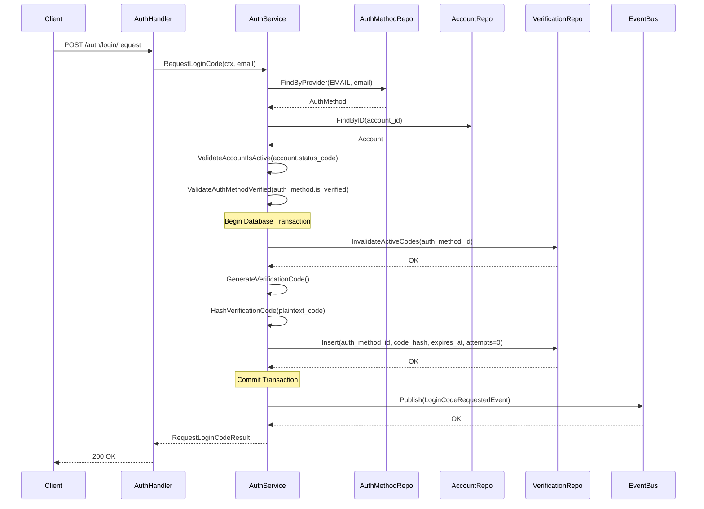

# Use Case: Request Login Code via Email

---

# Actors

* **Client**: Mobile or Web application
* **AuthHandler (API Layer)**: Handles HTTP transport and request/response parsing
* **AuthService (Application Layer)**: Orchestrates business logic and domain rules
* **AuthMethodRepository**: Handles persistence for authentication methods
* **AccountRepository**: Handles persistence for the `accounts` table
* **VerificationCodeRepository**: Handles persistence for OTP / verification codes
* **EventBus (Pub/Sub)**: Manages asynchronous event publishing

---

# Data Models

## accounts

* `id` (UUID)
* `status_code` (`PENDING`, `ACTIVE`, `BANNED`, `DELETED`)
* `role_code` (String)
* `created_at` (Timestamp)

---

## auth_methods

* `id` (UUID)
* `account_id` (UUID)
* `provider_code` (`EMAIL`, `GOOGLE`, etc.)
* `provider_id` (String — email)
* `is_verified` (Boolean)
* `last_login_at` (Timestamp, nullable)

---

## verification_codes

* `id` (UUID)
* `auth_method_id` (UUID)
* `code_hash` (String)
* `attempts` (Integer — initialized to 0)
* `expires_at` (Timestamp)
* `consumed_at` (Timestamp, nullable)
* `created_at` (Timestamp)

---

# Sequence Diagram



---

# Success Response

When the login code is successfully generated:

| Field                   | Type    | Description                              |
| ----------------------- | ------- | ---------------------------------------- |
| `message`               | String  | Login state indicator                    |
| `verification_required` | Boolean | Indicates email verification is pending  |
| `expires_in`            | Integer | Seconds before verification code expires |

---

### Response Body (200 OK)

```json
{
  "message": "login_verification_pending",
  "verification_required": true,
  "expires_in": 300
}
```

---

# Error Handling

| Error Code              | Trigger Condition              | State Consequence | HTTP Status | Response                               |
| ----------------------- | ------------------------------ | ----------------- | ----------- | -------------------------------------- |
| `invalid_credentials`   | Auth method not found          | No state mutation | 400         | `{ "error": "invalid_credentials" }`   |
| `invalid_account_state` | Account status ≠ `ACTIVE`      | No state mutation | 409         | `{ "error": "invalid_account_state" }` |
| `invalid_credentials`   | Auth method not verified       | No state mutation | 400         | `{ "error": "invalid_credentials" }`   |
| `internal_error`        | Any failure inside transaction | Full rollback     | 500         | `{ "error": "internal_error" }`        |

---

# Published Events

## LoginCodeRequestedEvent

Published after successful transaction commit.

### Payload

| Field        | Type    | Description                                 |
| ------------ | ------- | ------------------------------------------- |
| `account_id` | UUID    | Identifier of the account requesting login  |
| `email`      | String  | Email associated with the auth method       |
| `code`       | String  | Plaintext verification code                 |
| `expires_in` | Integer | Seconds until the verification code expires |

---

### Payload Example

```json
{
  "account_id": "uuid",
  "email": "user@email.com",
  "code": "123456",
  "expires_in": 300
}
```

---

# Operational Rules

* Login via email requires an existing `auth_method` with `provider_code = EMAIL`
* Only accounts in `ACTIVE` status may request login codes
* Only verified auth methods may request login codes
* There can be at most one active (unconsumed, non-expired) code per `auth_method`
* Generating a new login code invalidates any previous unconsumed code
* All verification code mutations must occur inside a single transaction
* Plaintext codes must never be persisted
* Event publication must occur only after successful transaction commit
* Repositories must not contain business logic
* Public error messages must not expose internal validation details

