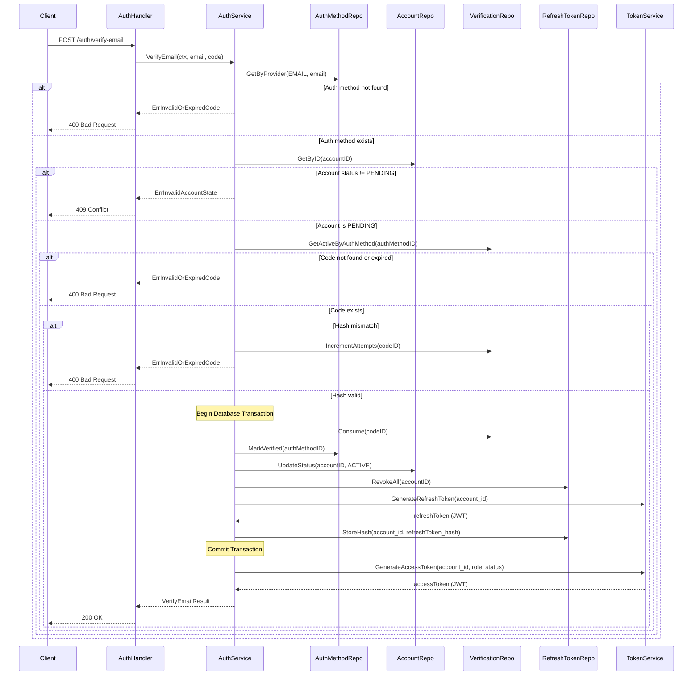
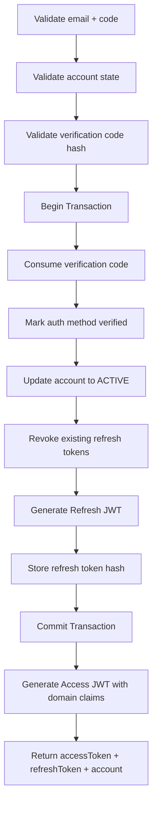

# Use Case: Verify Email Confirmation Code

---

## Actors

* **Client**: Mobile or Web application
* **AuthHandler (API Layer)**: Handles HTTP transport and request/response parsing
* **AuthService (Application Layer)**: Orchestrates business logic and domain rules
* **AccountRepository**: Handles persistence for the `accounts` table
* **AuthMethodRepository**: Handles persistence for authentication methods
* **VerificationCodeRepository**: Handles persistence for OTP / verification codes
* **RefreshTokenRepository**: Handles persistence for refresh tokens
* **TokenService**: Generates access and refresh JWT tokens

---

## Data Models

### accounts

* `id` (UUID)
* `status_code` (PENDING, ACTIVE, BANNED, DELETED)
* `role_code` (String)
* `created_at` (Timestamp)

---

### auth_methods

* `id` (UUID)
* `account_id` (UUID)
* `provider_code` (EMAIL, GOOGLE, etc.)
* `provider_id` (String — email)
* `is_verified` (Boolean)
* `last_login_at` (Timestamp, nullable)

---

### verification_codes

* `id` (UUID)
* `auth_method_id` (UUID)
* `code_hash` (String)
* `attempts` (Integer)
* `expires_at` (Timestamp)
* `consumed_at` (Timestamp, nullable)
* `created_at` (Timestamp)

---

### refresh_tokens

* `id` (UUID)
* `account_id` (UUID)
* `token_hash` (String)
* `revoked_at` (Timestamp, nullable)
* `expires_at` (Timestamp)
* `created_at` (Timestamp)

---

## Request DTO

```json
{
  "email": "user@email.com",
  "code": "123456"
}
```

---

## Response DTO (Success)

```json
{
  "accessToken": "jwt-access-token",
  "refreshToken": "jwt-refresh-token",
  "account": {
    "id": "uuid",
    "role": "USER",
    "status": "ACTIVE"
  }
}
```

HTTP Status: `200 OK`

---

## Error Responses

### Invalid or Expired Code

```json
{
  "error": "invalid_or_expired_code"
}
```

HTTP Status: `400 Bad Request`

---

### Invalid Account State

```json
{
  "error": "invalid_account_state"
}
```

HTTP Status: `409 Conflict`

---

# Updated Sequence Diagram



---

# Logical Flow Overview



---

# Detailed Flow

---

## 1. Client → API

Endpoint:

```
POST /auth/verify-email
```

Payload:

```json
{
  "email": "user@email.com",
  "code": "123456"
}
```

---

## 2. API Layer

### Responsibilities

* Parse request body
* Validate input format
* Call application service
* Map domain errors to HTTP responses
* Return JSON response

---

## 3. Application Layer

### Method

```
VerifyEmail(ctx, email, code)
```

---

## Step 1 — Retrieve Auth Method

* `GetByProvider(EMAIL, email)`

Validation rules:

* Must exist
* Must belong to EMAIL provider

If not found → `ErrInvalidOrExpiredCode`

---

## Step 2 — Retrieve Account

* `GetByID(accountID)`

Validation rules:

* `status_code` must be `PENDING`
* If `ACTIVE` → invalid state
* If `BANNED` or `DELETED` → authentication not allowed

If invalid → `ErrInvalidAccountState`

---

## Step 3 — Retrieve Active Verification Code

* `GetActiveByAuthMethod(authMethodID)`

Validation rules:

* Must exist
* `expires_at` must be greater than current time
* `consumed_at` must be null

If hash comparison fails:

* `IncrementAttempts(codeID)`
* Return `ErrInvalidOrExpiredCode`

---

## Step 4 — Transaction

The following operations must occur atomically:

* Consume verification code
* Mark auth method as verified
* Update account status to `ACTIVE`
* Revoke all existing refresh tokens
* Generate new refresh token (JWT)
* Persist refresh token hash

If any step fails → rollback

---

## Step 5 — Access Token Generation (After Commit)

After successful transaction commit:

1. Generate **Access Token (JWT)** containing:

   * `account_id`
   * `role`
   * `status`

2. Return response with:

   * `accessToken`
   * `refreshToken`
   * `account`

---

# Final State

* Account status updated to `ACTIVE`
* Auth method marked as verified
* Verification code consumed
* Previous refresh tokens revoked
* One new active refresh token stored
* Access token issued
* Refresh token issued

---

# Transactional Considerations

* All state mutations and refresh token generation must be atomic
* No tokens are issued if the transaction fails
* Only one active refresh token per account is allowed
* Public error messages do not expose internal validation details
